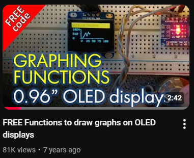
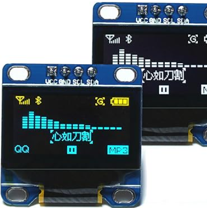
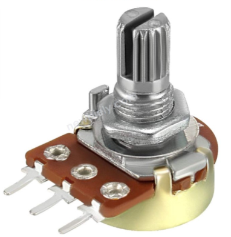
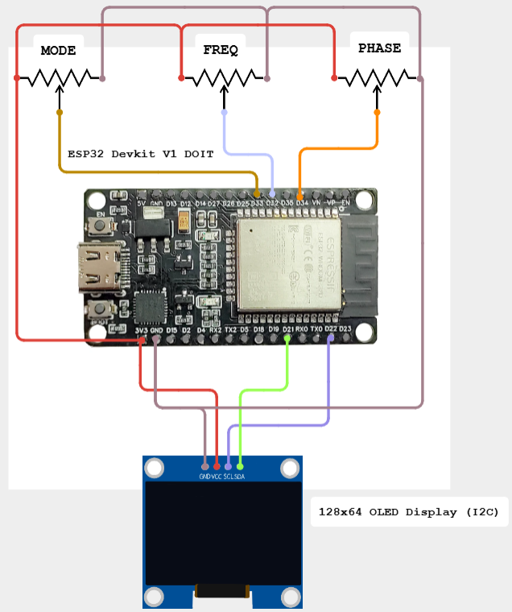

# README

## Description

This is my project for a 1306 128x64 OLED screen with an ESP32 over I2C.

**Demo Video:** https://youtu.be/hutwwg36yZc

***
The program `oled_display.ino` is a fork of KrisKasprzak's OLED_Graphing.ino file, found through his youtube video:

https://www.youtube.com/watch?v=13PFOwcK3-I&ab_channel=KrisKasprzak

***

I altered his code to work with an ESP32 Devkit V1 - DOIT.

It displays an animation drawing of a function. It has 4 functions to choose from with the `MODE_PIN` potentiometer:

| **Sin**                      | **Cos**                   |
| ---------------------------- | ------------------------- |
|        |     |

| **Square**                   | **Triangle**                 |
| ---------------------------- | ------------------------- |
|  | |

| **Sawtooth**                   | **Noise**                 |
| ---------------------------- | ------------------------- |
|  | |

By changing the mode parameter and adjusting the `checkMode()` function, one can add more functions to animate.

The `phase` and `frequency` can be altered with the other knobs and affect all the modes (except for the `Noise` signal).

It can also change display modes, but this must be done through the code.

|**Labeled**|**Center X-Axis**|
|----|-----|
|||

|**Center Y-Axis**|**Center Both Axes**|
|------|--------|
|||

## Parts List

| **ESP32 Devkit V1 DOIT** | **1306 128x64 OLED Screen** | **3x Potentiometers** |
| ------------------------ | --------------------------- | --------------------- |
|           |        |     |

## Wiring Diagram

**ESP32 Pinout**

**1306 OLED Pinout**

## Code Description

***Setup***

It uses a global `x` variable to and each call of the `graph()` function must increase x: `x++`.

It also uses global `mode`, `freq`, and `phase` variables that are attached to each of the potentiometers.

After initializing the ESP32's Serial interface in the `setup()` function, it then checks if the 1306 OLED screen is properly connected.

The program then displays the pre-loaded Adafruit logo before clearing the screen. It then moves to the `loop()` function.
******

***Loop***

The `loop()` function first reads each of the potentiometer values and assigns them to corresponding variables.

It then calls the `checkMode()` function, which determines what graph to animate depending on the global `mode` variable.

## Conclusion & Further Work

I would like to make the graph fade out before it loops, so it's not as jarring. This also might make switching modes look much better.

For future projects, this could be a real-time display for audio signals, as well as UIs for synths.