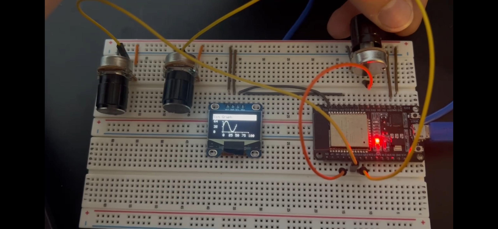

# README

## Description

This is my project for a 1306 128x64 OLED screen with an ESP32 over I2C. 

**Demo**
[](./images/demo.mov)

***
The program `oled_display.ino` is a fork or KrisKasprzak's OLED_Graphing.ino file, found through his youtube video:

[](https://www.youtube.com/watch?v=13PFOwcK3-I&ab_channel=KrisKasprzak)

***

I altered his code to work with an ESP32 Devkit V1 - DOIT.

It displays an animation drawing of a function. It has 4 functions to choose from with the `MODE_PIN` potentiometer:

| **Sin**                      | **Cos**                   |
| ---------------------------- | ------------------------- |
|        |     |

| **Square**                   | **Noise**                 |
| ---------------------------- | ------------------------- |
|  | |

By changing the mode parameter and adjusting the `checkMode()` function, one can add more functions to animate.

## Parts List

| **ESP32 Devkit V1 DOIT** | **1306 128x64 OLED Screen** | **3x Potentiometers** |
| ------------------------ | --------------------------- | --------------------- |
|      [](https://www.amazon.com/dp/B08D5ZD528?ref=ppx_yo2ov_dt_b_fed_asin_title&th=1)     |    [](https://www.amazon.com/dp/B0D1C51G48?ref=ppx_yo2ov_dt_b_fed_asin_title&th=1)    |     |

## Wiring Diagram


**ESP32 Pinout**

[](https://www.espboards.dev/esp32/esp32doit-devkit-v1/)

**1306 OLED Pinout**

[](https://app.cirkitdesigner.com/project/4532d6f5-5b08-490d-a55c-c5690e6aef9a)

## Block Diagram


## Pseudocode

```

int mode = 1;
double x = 0;
double y = 0;

double phase = 0;
double freq = 1;

bool redraw = true;

int xmin = 0;
int xmax = 100;
int ymin = 0;
int ymax = 64;

void setup() {
  Serial.begin(9600);

  if(!display.begin(SSD1306_SWITCHCAPVCC, SCREEN_ADDRESS)) {
    Serial.println(F("SSD1306 allocation failed"));
    for(;;); // Don't proceed, loop forever
  }
  display.display(); // Display Adafruit Logo
  delay(2000);

  display.clearDisplay();
  delay(2000);
}

void loop() {

  mode = read(MODE_PIN);

  freq = read(FREQ_PIN);
  phase = read(PHASE_PIN);
  
  checkMode();

}

void checkMode() {
  switch (mode) {
    case 1:
      graphSin();
      break;
    case 2: 
      graphCos();
      break;
    case 3:
      graphSquare();
      break;
    case 4:
      graphNoise();
      break;
    default:
      break;
  }
}

void graphNoise() {
  float rand = 1.0*random(ymin, ymax);
  
  graph(display, x++, rand, "Random Number");
}

void graphSin() {
  double y = ymax*(sin(2*M_PI*(freq*x/xmax + phase))+1)/2;
  graph(display, x++, val, "Sin Graph");
}

void graphCos() {
  double val = ymax*(cos(2*M_PI*(freq*x/xmax + phase))+1)/2;
  graph(display, x++, val, "Cos Graph");
}

void graphSquare() {
  double val = cos(2*M_PI*(freq*x/xmax + phase)) > 0 ? ymax - 1 : ymin + 1;
  graph(display, x++, val, "Square Graph");
}

void redrawAxes() {
    drawTitle(); // Filled Rectangle with Text at top of screen

    drawY_Axis();
    drawX_Axis();
}

void graph(Adafruit_SSD1306 &display, double x, double y, String title) {
    if (x == 100) {
        // Reset
        x = 0;
        display.clearDisplay();

        // Initialize
        drawTitle();
        drawY_Axis();
        drawX_Axis();
    }

    // Draw line segment to add data
    display.drawLine(ox, oy, x, y, white);
    ox = x;
    oy = y;
}
```

**Code Description**

*Setup*

It uses a global `x` variable to and each call of the `graph()` function must increase x: `x++`.

It also uses global `mode`, `freq`, and `phase` variables that are attached to each of the potentiometers.

After initializing the ESP32's Serial interface in the `setup()` function, it then checks if the 1306 OLED screen is properly connected.

The program then displays the pre-loaded Adafruit logo before clearing the screen. It then moves to the `loop()` function.

*Loop*

The `loop()` function first reads each of the potentiometer values and assigns them to corresponding variables.

It then calls the `checkMode()` function, which determines what graph to animate depending on the global `mode` variable.

## Conclusion & Further Work

I intend to add both triangle and sawtooth wave functions.

In addition to multiple axes options (i.e. x-axis centered, y-axis centered, etc.), this will likely include different functions for each option.

I would also like to make the fade out before it loops, so it's not as jarring.

For future projects, this will be a real-time display for audio signals.